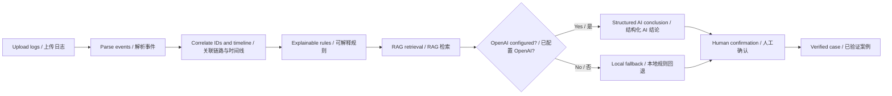

# TraceJudge

> **Evidence-backed triage for automated-test failures.** TraceJudge identifies the most likely owner of a failure, shows the evidence, and recommends the next verification step.
> **面向自动化测试失败的证据化归因工具。** TraceJudge 判断最可能的责任归属，展示证据，并给出下一步验证建议。

[](backend/)
[](frontend/)
[](docs/requirements.md)

## What it does / 功能概览

TraceJudge correlates logs from test tools, devices, product services, and environments into one timeline. It combines explainable rules, a repository-native RAG knowledge base, optional OpenAI enhancement, and human confirmation to produce an auditable conclusion.
TraceJudge 将测试工具、设备、产品服务和环境日志关联到同一时间线中，并结合可解释规则、仓库内 RAG 知识库、可选 OpenAI 增强和人工确认，输出可审查的结论。

| Classification / 归因 | Meaning / 含义 |
| --- | --- |
| `PRODUCT_DEVICE` | Product logic, service, firmware, device hardware, or device configuration / 产品逻辑、服务、固件、设备硬件或设备配置 |
| `TEST_TOOL` | Script, framework, driver, parser, locator, timeout, or retry strategy / 脚本、框架、驱动、解析器、定位、超时或重试策略 |
| `ENVIRONMENT` | Network, permission, power, dependency, or test-environment issue / 网络、权限、供电、依赖服务或测试环境问题 |
| `UNKNOWN` | Evidence is insufficient; do not force an attribution / 证据不足，不强行归因 |

## UI preview / 界面预览

### Upload and label logs / 上传并标记日志

Choose the source for every file. Device model, product version, and tool version are optional metadata. v1 accepts ordinary `.log` and `.txt` files.
为每个文件选择来源。设备型号、产品版本和工具版本为可选元信息。v1 支持普通 `.log` 与 `.txt` 文件。


### Review attribution and evidence / 查看归因和证据

The result page presents a classification, confidence, rule scores, log-line evidence, knowledge references, counter-evidence, and concrete verification actions. `UNKNOWN` is returned when the evidence cannot support a reliable conclusion.
结果页展示归因、置信度、规则评分、日志行证据、知识库引用、反证与可执行验证动作；当证据不足时会返回 `UNKNOWN`。


## How it works / 工作原理



## Quick start / 快速开始

### Prerequisites / 前置条件

- Python 3.11+ and Node.js 20+ / Python 3.11+ 与 Node.js 20+
- Optional: Docker and Docker Compose / 可选：Docker 与 Docker Compose
- Optional: an OpenAI API key for embeddings and enhanced triage / 可选：用于 embedding 和增强归因的 OpenAI API Key

### Run locally / 本地运行

Start the backend / 启动后端：

```bash
cd backend
python3 -m venv .venv
source .venv/bin/activate
pip install -e '.[dev]'
uvicorn app.main:app --reload
```

Start the frontend in another terminal / 在另一个终端启动前端：

```bash
cd frontend
npm install
npm run dev
```

Open [http://localhost:3000](http://localhost:3000). Interactive API documentation is available at [http://localhost:8000/docs](http://localhost:8000/docs).
访问 [http://localhost:3000](http://localhost:3000)。交互式 API 文档位于 [http://localhost:8000/docs](http://localhost:8000/docs)。

### Run with Docker / 使用 Docker 运行

```bash
cp .env.example .env
docker compose up --build
```

The app works without `OPENAI_API_KEY`: it uses local rules and keyword retrieval, and clearly marks AI enhancement as unavailable. With a key, Chroma stores local vectors using `text-embedding-3-small`, and OpenAI produces a constrained JSON conclusion.
即使不设置 `OPENAI_API_KEY`，应用也可使用本地规则和关键词检索运行，并明确标记 AI 增强不可用。设置密钥后，Chroma 使用 `text-embedding-3-small` 保存本地向量，OpenAI 生成受约束的 JSON 结论。

## Try the included samples / 试用内置样例

| Directory / 目录 | Symptom / 现象 | Expected result / 预期 |
| --- | --- | --- |
| `sample-data/product-device` | Service returns HTTP 500 / 服务返回 HTTP 500 | `PRODUCT_DEVICE` |
| `sample-data/test-tool` | Locator timeout; device renders the page later / 工具定位超时，设备随后渲染页面 | `TEST_TOOL` |
| `sample-data/environment` | DNS or network unavailable / DNS 或网络不可达 | `ENVIRONMENT` |
| `sample-data/unknown` | No clear error / 无明确异常 | `UNKNOWN` |

Upload the files in one directory and assign the matching sources in the UI. The regression suite covers the same samples:
在 UI 中上传同一目录的文件并选择匹配来源。回归测试覆盖同一批样例：

```bash
cd backend
pytest -q
```

## Knowledge base and RAG / 知识库与 RAG

The knowledge base is versioned Markdown, so reviews and pull requests can inspect every source.
知识库采用版本化 Markdown，因此每个来源都可在代码审查和 Pull Request 中检查。

```text
knowledge-base/
├── product/       # Product, API, error-code, and device knowledge / 产品、接口、错误码和设备知识
├── test-tool/     # Framework, script, timeout, and adapter knowledge / 框架、脚本、超时和适配知识
└── cases/         # Verified historical cases / 已验证历史案例
```

Only cases marked `verified: true` receive high-confidence retrieval weighting. Confirming a result in the UI creates a new case Markdown file and reindexes the knowledge base.
只有标记为 `verified: true` 的案例会获得高可信召回权重。在 UI 中确认结果后，系统会创建新案例 Markdown 并重新索引知识库。

## Project layout / 项目结构

```text
tracejudge-ai/
├── backend/
│   ├── app/{api,parsers,correlator,rules,rag,llm,persistence}/
│   └── tests/
├── frontend/             # Next.js web UI / Next.js Web 界面
├── knowledge-base/       # Versioned RAG sources / 版本化 RAG 来源
├── sample-data/          # Regression samples / 回归样例
├── docs/                 # Requirements and technical documentation / 需求和技术文档
└── docker-compose.yml
```

Read the [requirements / 需求](docs/requirements.md), [architecture / 架构](docs/architecture.md), [API specification / API 说明](docs/api-spec.md), [data model / 数据模型](docs/data-model.md), and [evaluation guide / 评测规范](docs/evaluation.md) for implementation details.

## API overview / API 概览

| Method / 方法 | Path / 路径 | Purpose / 用途 |
| --- | --- | --- |
| `POST` | `/api/analyses` | Upload logs and create an analysis / 上传日志并创建分析 |
| `GET` | `/api/analyses/{id}` | Read an analysis / 读取分析结果 |
| `POST` | `/api/analyses/{id}/confirmation` | Confirm root cause and save a case / 确认根因并沉淀案例 |
| `POST` | `/api/knowledge/reindex` | Reindex Markdown knowledge / 重建 Markdown 知识索引 |
| `GET` | `/api/health` | Check API and knowledge status / 检查 API 和知识库状态 |

## Privacy and trust / 隐私与可信性

- Secrets come only from environment variables and are never written to code, SQLite, or logs. / 密钥只从环境变量读取，绝不写入代码、SQLite 或日志。
- Before SQLite persistence, Bearer tokens, explicit tokens, emails, and mainland-China phone numbers are redacted. / 写入 SQLite 前会脱敏 Bearer Token、显式 Token、邮箱和中国大陆手机号。
- The UI distinguishes log facts, rule matches, and model inferences. / UI 明确区分日志事实、规则命中和模型推断。
- Provider failures fall back to local evidence-based results; no AI conclusion is fabricated. / 模型服务失败时安全回退到本地证据化结果，不会伪造 AI 结论。

## Contributing / 贡献

Contributions are welcome for parsers, rules, samples, and sanitized knowledge documents. Before submitting a change:
欢迎贡献新的解析器、规则、样例和脱敏知识文档。提交变更前请：

1. Add a regression sample and test for every new parser or rule. / 为每个新解析器或规则添加回归样例和测试。
2. Update the affected requirements and design documentation. / 更新受影响的需求和设计文档。
3. Verify the frontend build and backend tests. / 验证前端构建和后端测试。
4. Never commit production secrets, unredacted logs, or personal data. / 不提交生产密钥、未脱敏日志或个人数据。

Every confirmed requirement or implementation change is verified, committed, and pushed to GitHub.
每项已确认的需求或实现变更都会经过验证、提交并推送至 GitHub。
