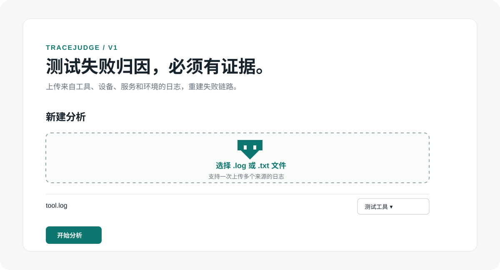
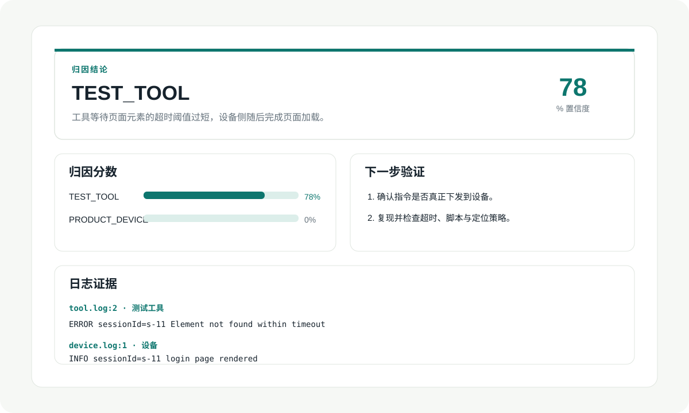
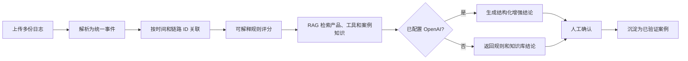

# TraceJudge

> 面向自动化测试失败日志的可解释归因工具。它不只说“失败了”，还会指出**更可能是谁的问题、依据是什么，以及接下来怎么验证**。

[](backend/)
[](frontend/)
[](docs/requirements.md)

TraceJudge 将测试工具、设备、产品服务和环境日志放在同一时间线中分析，结合可解释规则、仓库内 RAG 知识库、可选 OpenAI 增强和人工确认闭环，输出可追溯的失败归因。

## 适用场景

- 自动化用例失败后，需要快速初步判断是产品/设备、测试工具还是环境问题。
- 同一失败涉及多份日志，希望按 `traceId`、`requestId`、`sessionId` 或 `deviceId` 串起证据。
- 希望把已验证的历史故障转化成下一次排障时可检索的知识。
- 团队需要“有依据的建议”，而不是不可审查的 AI 结论。

## 界面预览

### 1. 上传并标记日志来源

为每个文件选择其来源；设备型号、产品版本和工具版本均可选填。v1 支持普通 `.log` 与 `.txt` 文件。



### 2. 查看归因、证据和验证动作

结论页同时展示分类、置信度、规则评分、日志行证据、知识库引用、反证与建议的验证动作。没有足够证据时会返回 `UNKNOWN`，而不是强行猜测。



## TraceJudge 如何工作



输出的归因仅有四类：

| 分类 | 说明 |
| --- | --- |
| `PRODUCT_DEVICE` | 产品业务、服务、固件、设备硬件或配置问题 |
| `TEST_TOOL` | 脚本、框架、驱动、解析、元素定位、超时或重试策略问题 |
| `ENVIRONMENT` | 网络、权限、供电、依赖服务或测试环境问题 |
| `UNKNOWN` | 证据不足，需补充日志或进行交叉验证 |

## 快速开始

### 前置条件

- Python 3.11+
- Node.js 20+
- 可选：Docker 与 Docker Compose
- 可选：OpenAI API Key，用于 embedding 和增强归因

### 本地启动

启动后端：

```bash
cd backend
python3 -m venv .venv
source .venv/bin/activate
pip install -e '.[dev]'
uvicorn app.main:app --reload
```

另开一个终端启动前端：

```bash
cd frontend
npm install
npm run dev
```

访问 [http://localhost:3000](http://localhost:3000)，后端交互式 API 文档位于 [http://localhost:8000/docs](http://localhost:8000/docs)。

### Docker 启动

```bash
cp .env.example .env
docker compose up --build
```

未填写 `OPENAI_API_KEY` 也可以运行：系统会使用规则与本地关键词检索，并在界面明确显示“未配置 AI 增强”。填写密钥后，Chroma 使用 `text-embedding-3-small` 为 Markdown 知识库建立本地向量索引，同时由模型产出受约束的 JSON 结论。

## 用样例快速验证

仓库自带四组脱敏样例日志：

| 目录 | 现象 | 预期 |
| --- | --- | --- |
| `sample-data/product-device` | 服务返回 HTTP 500 | `PRODUCT_DEVICE` |
| `sample-data/test-tool` | 工具元素定位超时、设备随后渲染页面 | `TEST_TOOL` |
| `sample-data/environment` | DNS / 网络不可达 | `ENVIRONMENT` |
| `sample-data/unknown` | 无明确异常 | `UNKNOWN` |

在页面中上传同一目录下的文件，并按文件名选择相应来源，即可演示完整分析流。后端回归测试也覆盖这些场景：

```bash
cd backend
pytest -q
```

## 知识库与 RAG

知识库使用仓库内 Markdown，便于审阅、版本控制和 PR 讨论：

```text
knowledge-base/
├── product/       # 错误码、接口和设备知识
├── test-tool/     # 框架、脚本、超时与适配知识
└── cases/         # 已验证的历史案例
```

只有带有 `verified: true` 的案例会作为高可信案例加权召回。用户在网页中确认根因后，系统会生成新的案例 Markdown，并重新索引知识库。

## 项目结构

```text
tracejudge-ai/
├── backend/
│   ├── app/
│   │   ├── api/          # HTTP 路由
│   │   ├── parsers/      # 日志格式适配器
│   │   ├── correlator/   # 分析编排和时间线关联
│   │   ├── rules/        # 可解释规则引擎
│   │   ├── rag/          # Markdown / Chroma 检索
│   │   ├── llm/          # 模型集成边界
│   │   └── persistence/  # SQLite 和脱敏存储
│   └── tests/
├── frontend/             # Next.js Web UI
├── knowledge-base/       # 可版本化的 RAG 知识
├── sample-data/          # 回归样例
├── docs/                 # 需求、架构、API、数据和评测文档
└── docker-compose.yml
```

更多设计细节见：[需求基线](docs/requirements.md) · [架构](docs/architecture.md) · [API](docs/api-spec.md) · [数据模型](docs/data-model.md) · [评测规范](docs/evaluation.md)。

## API 概览

| 方法 | 路径 | 说明 |
| --- | --- | --- |
| `POST` | `/api/analyses` | 上传日志并创建分析 |
| `GET` | `/api/analyses/{id}` | 读取分析结果 |
| `POST` | `/api/analyses/{id}/confirmation` | 确认根因并沉淀案例 |
| `POST` | `/api/knowledge/reindex` | 重新索引 Markdown 知识库 |
| `GET` | `/api/health` | 检查服务与知识库状态 |

完整请求格式和错误处理规则见 [API 文档](docs/api-spec.md)。

## 隐私与可信性

- 密钥只从环境变量读取，绝不会写入代码、SQLite 或日志。
- 写入 SQLite 前会脱敏 Bearer Token、显式 Token、邮箱和手机号。
- 结果明确区分日志事实、规则命中和模型推断。
- 每个非 `UNKNOWN` 结论都应带日志证据与可执行验证动作。
- 模型或服务异常时，系统安全降级为本地规则结论，绝不伪造 AI 输出。

## 贡献与开发约定

欢迎提交新的日志解析器、规则、样例和已脱敏知识文档。提交前请：

1. 为新规则或解析逻辑添加回归样例和测试；
2. 更新受影响的 `docs/requirements.md` 与设计文档；
3. 确保前端构建与后端测试通过；
4. 不提交真实密钥、未脱敏生产日志或个人数据。

项目维护约定是：每个已确认的需求或实现变更都会经过验证、创建 Git 提交并推送至 GitHub。
